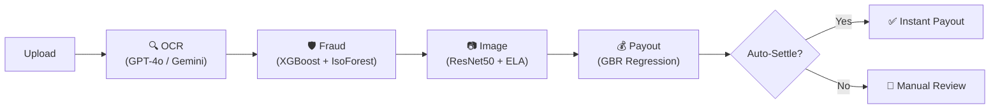

# 🛡️ ClaimAI — End-to-End Insurance Claims Automation System

> File a claim. Get a decision in minutes. Powered by XGBoost, ResNet, and LLM extraction.

---

## Architecture

```
policyholders → React Form → FastAPI → [OCR → Fraud → Image → Payout] → Auto-Settlement
                                  ↑                                           ↓
                               PostgreSQL  ←────────────── Audit / Fraud Logs
```

**Auto-Approve** when: `fraud_score < 0.20` **AND** `payout_match > 90%` **AND** `image_valid`  
**Flag for Manual Review** otherwise.

---

## Quick Start

### 1 – Clone & configure

```bash
git clone <repo-url>
cd Insurance
cp .env.example .env
# Edit .env — set OPENAI_API_KEY or GEMINI_API_KEY
```

### 2 – Train AI models (first time only)

```bash
cd ..
pip install -r backend/requirements.txt

python ml/train_fraud_model.py   # → ml/models/fraud_xgb.pkl, iso_forest.pkl
python ml/train_payout_model.py  # → ml/models/payout_model.pkl
```

Expected output:
```
XGBoost AUC: ~0.93
Payout MAE:  ~$1,200
```

### 3a – Run locally (recommended for development)

**Backend:**
```bash
cd backend
pip install -r requirements.txt
uvicorn backend.main:app --reload --port 8000
# API: http://localhost:8000
# Swagger UI: http://localhost:8000/docs
```

**Frontend (separate terminal):**
```bash
cd frontend
npm install
npm run dev
# App: http://localhost:5173
```

### 3b – Run with Docker Compose

```bash
docker-compose up --build
# Frontend: http://localhost:5173
# Backend:  http://localhost:8000
# Swagger:  http://localhost:8000/docs
```

---

## API Reference

| Method | Endpoint             | Description                                   |
|--------|----------------------|-----------------------------------------------|
| POST   | `/api/submit-claim`  | Submit a new claim (multipart/form-data)      |
| POST   | `/api/check-fraud`   | Re-run fraud check on existing claim          |
| GET    | `/admin/dashboard`   | Aggregate stats for dashboard                 |
| GET    | `/admin/claims`      | Paginated claims list (filter by status)      |
| GET    | `/admin/heatmap`     | Fraud score heatmap data                      |
| GET    | `/health`            | Health check                                  |

### POST `/api/submit-claim` — Form Fields

| Field             | Type    | Required | Description                            |
|-------------------|---------|----------|----------------------------------------|
| `claim_type`      | string  | ✅       | `health/auto/property/life/travel`     |
| `description`     | string  | ✅       | Min 20 chars                           |
| `requested_amount`| float   | ✅       | Amount in USD                          |
| `full_name`       | string  | ✅       |                                        |
| `email`           | string  | ✅       | Valid email                            |
| `phone`           | string  |          |                                        |
| `policy_number`   | string  |          |                                        |
| `incident_date`   | string  |          | ISO date                               |
| `files`           | files   |          | Images / PDFs (max 5 × 10 MB)         |

---

## AI Pipeline



| Model          | Algorithm                | Purpose                       |
|----------------|--------------------------|-------------------------------|
| Fraud Engine   | XGBoost + Isolation Forest | Tabular fraud probability    |
| Image Analyser | ResNet50 + OpenCV ELA    | Damage detection + forgery    |
| Payout Model   | GradientBoostingRegressor | Fair payout estimation        |
| OCR            | GPT-4o Vision / Gemini   | Document data extraction      |

---

## Project Structure

```
Insurance/
├── backend/
│   ├── main.py              # FastAPI app
│   ├── config.py            # Settings (Pydantic)
│   ├── database.py          # SQLAlchemy engine
│   ├── models.py            # ORM models
│   ├── schemas.py           # Pydantic schemas
│   ├── Dockerfile
│   ├── requirements.txt
│   ├── routes/
│   │   ├── claims.py        # /submit-claim, /check-fraud
│   │   └── admin.py         # /admin/*
│   └── services/
│       ├── ocr_service.py
│       ├── fraud_service.py
│       ├── image_service.py
│       └── payout_service.py
├── ml/
│   ├── train_fraud_model.py
│   ├── train_payout_model.py
│   └── models/              # .pkl files (git-ignored)
├── frontend/
│   ├── src/
│   │   ├── App.jsx
│   │   ├── api/index.js
│   │   ├── components/
│   │   │   ├── ClaimForm.jsx
│   │   │   ├── AdminDashboard.jsx
│   │   │   ├── FraudHeatmap.jsx
│   │   │   └── ClaimsTable.jsx
│   │   └── styles/global.css
│   └── package.json
├── docker-compose.yml
├── .env.example
└── README.md
```

---

## Environment Variables

See `.env.example` for the full list. Key variables:

| Variable               | Default | Description                     |
|------------------------|---------|---------------------------------|
| `DATABASE_URL`         | —       | PostgreSQL connection string     |
| `OPENAI_API_KEY`       | —       | For GPT-4o Vision OCR           |
| `GEMINI_API_KEY`       | —       | Alternative LLM provider        |
| `LLM_PROVIDER`         | openai  | `openai` or `gemini`            |
| `FRAUD_THRESHOLD`      | 0.2     | Score below = auto-approve safe |
| `PAYOUT_MATCH_THRESHOLD`| 0.90  | Match above = auto-approve      |

---

## Hackathon Notes

- **No LLM key?** System falls back to mock OCR — all other AI layers still work.
- **No GPU?** ResNet50 runs on CPU; inference takes ~0.5s per image.
- **No PostgreSQL?** Change `DATABASE_URL` to `sqlite:///./insurance.db` for SQLite.
- Model `.pkl` files are git-ignored. Run training scripts once before starting the backend.
